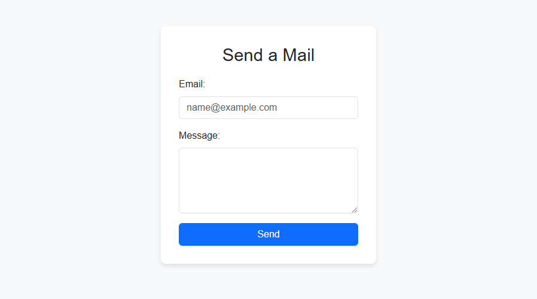

# PHPMAILER SEND MAIL



This project allows users to send an email via a simple form. The form collects the user's email address and a message. Upon form submission, it sends the email using the PHPMailer library. The feedback (success or error) is displayed on the page using session-based messages.

## Features:
- Form to send an email with user input (email and message)
- Success and error feedback after form submission
- PHP session-based message handling
- Uses PHPMailer to send the email through an SMTP server (e.g., Gmail)
- Built with Bootstrap for a responsive design

## Prerequisites:
- PHP 7.0 or higher
- Composer for managing PHPMailer dependencies (if needed)

## Setup:

1. Clone this repository:
    ```bash
    git clone https://github.com/oguzhansen/phpmailer-send-mail.git
    cd phpmailer-send-mail
    ```
    
2. Update your SMTP configuration in `send_mail.php`:
    - Replace `Your Mail Address` with your actual SMTP email address.
    - Replace `Your Mail SMTP Password` with your SMTP application password.
    Example SMTP settings for Gmail:
    - SMTP Host: `smtp.gmail.com`
    - SMTP Port: `465`
    - Encryption: `SMTPS`

3. Upload the project to your server and access it through your browser.

## Usage:
- Go to the main page (`index.php`) and fill in the email and message.
- Once the form is submitted, the email will be sent through the configured SMTP server.
- Success or error messages will be displayed based on the outcome of the email sending process.

## License:
This project is licensed under the MIT License - see the [LICENSE](LICENSE) file for details.
